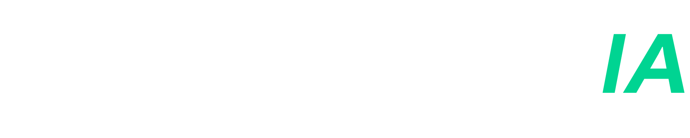

# GymProgress IA

<p align="center">
  
</p>

Plataforma web desenvolvida para auxiliar praticantes de academia por meio de Inteligência Artificial generativa, permitindo gerenciamento de fichas de treino, organização de exercícios e interação com um assistente virtual contextualizado às características do usuário.

## Funcionalidades

* Cadastro e autenticação com e-mail e senha;
* Login utilizando conta Google;
* Gerenciamento de perfil do usuário;
* Histórico de conversas com a Inteligência Artificial;
* Controle diário de utilização da IA;
* Gerenciamento de fichas de treino;
* Organização de divisões e exercícios;
* Respostas personalizadas com base no perfil do usuário.

## Tecnologias utilizadas

### Frontend

* Next.js
* React
* TypeScript
* Tailwind CSS
* Firebase Authentication

### Backend

* NestJS
* TypeScript
* Firebase Admin SDK
* Cloud Firestore
* Gemini API

## Estrutura do projeto

```text
gymprogress-ia/
├── gymprogress-ia/
├── gymprogress-api/
└── README.md
```

## Execução do projeto

### Frontend

```bash
cd gymprogress-ia
npm install
npm run dev
```

### Backend

```bash
cd gymprogress-api
npm install
npm run start:dev
```

## Requisitos

* Node.js v22.21.1
* Conta Firebase
* Chave de acesso da Gemini API
* Arquivos de variáveis de ambiente configurados

## Autor

Gabriel Maurício

Trabalho de Conclusão de Curso (TCC)
GymProgress IA: Plataforma Inteligente para Acompanhamento de Treinos com Inteligência Artificial.
